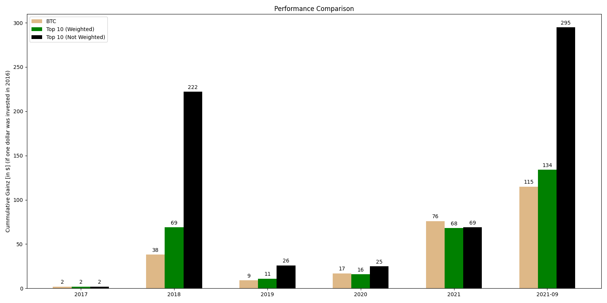
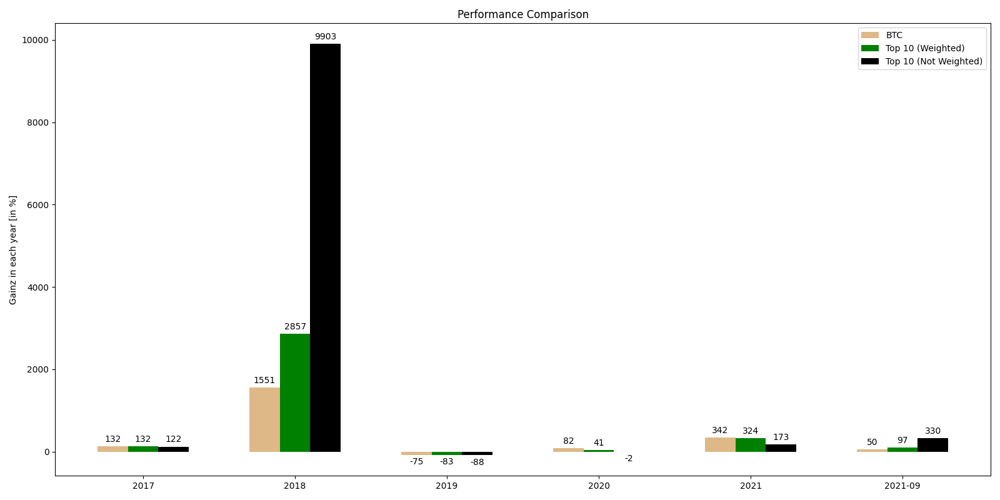

## Idea
There are numerous analyses of investment strategies in assets.   
A typical one is to track an index and if necessary with occasional rebalancing.   
Since I could not find such an analysis and other users did not know any (https://www.reddit.com/r/CryptoCurrency/comments/pahg96/q_performance_of_weighted_replicated_top_10_coins/), I started to write such an analysis myself as an opensource project.

I compared the performance of Bitcoin with the investment on the Top10 index.   
On the one hand "non-weighted", so in each of the Top10 coins the same amount invest.    
On the other hand "weighted", i.e. investing different amounts in the top10 according to market capitalization.   
Since some countries prescribe holding periods of one year to be tax-free, the period of analysis is chosen so that the Top10 coins are were for 1 year and then invested again in the then current Top10. Trading fees are neglected in this analysis.

The first plot shows how many dollars you would have now (01-09-2021) if you had invested $1 in January 2016.
The second plot shows the gains in percent per year.

#### If 1 Dollar was invested in January 2016:
Date / Asset | BTC [$] | Index10 (w*) [$] | Index10 (nw**) [$]
-------- | -------- | --------| -------- 
01-2017   | 2   | 2  | 2
01-2019  | 38   | 69  | 222
01-2019  | 9   | 11  | 26
01-2020  | 17   | 16  | 25
01-2021  | 76   | 68  | 69
09-2021  | 100   | 118  | 244

\* Index10 (w): Each coin is allocated a certain percentage of the total money supply according to its market capitalization at the beginning of the year. A corresponding redistribution always takes place at the beginning of each year.  
\* Index10 (nw**): Each Top10 coin is weighted equally. So in 2016, in each coin $0.1 was invested. After one year, the gains are reweighted so that the coins then present in the Top10 each have 1/10 of the current sum of money again.  

The results are not an investment recommendation.   

Everyone who likes can continue to work on the project or write suggestions for further analyses.

Historical data from Coinmarketcap.com was used as the data basis:
https://coinmarketcap.com/de/historical/
